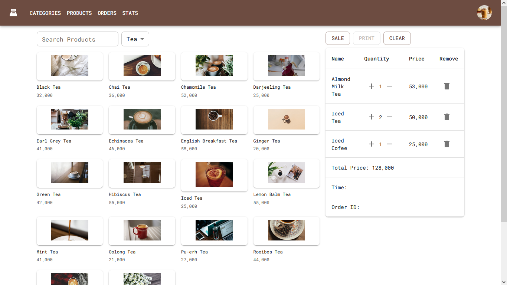

# Simple POS

## Overview

This is a simple point of sale (POS) app designed for a small coffee shop.

## Features

- **Product Catalog**: Browse and search for products in the coffee shop's catalog.
- **Category Filter**: Filter products by category.
- **Sale**: Complete the sale by calculating the total amount and creating an order.
- **Print Receipt**: Print a receipt for the completed order.
- **Email Receipt**: Email a receipt to customer email.
- **Statistics**: Display revenue bar graphs.

## Screenshots

*Dashboard*

## Stack

- **React**: Front-end framework for building the user interface.
- **Material-UI**: UI component library for a consistent and responsive design.
- **Node.js**: JavaScript runtime for server-side logic.
- **MongoDB**: Database for storing product and order data.

## Getting Started

1. Clone the repository: `git clone https://github.com/dinhlab/effective-goggles.git`
2. Install dependencies: `npm install` or `yarn install`
3. Start the development server: `npm start` or `yarn start`

## Usage

### Staff
1. Browse the product catalog and add items to the order.
2. Adjust quantities and delete items in the order as needed.
3. Click the "Sale" button to proceed with the checkout.
4. Optionally, click the "Print" button to print the order receipt.
5. Click the "Clear" button to empty the order and start a new sale.
6. Send the receipt to customer if they need.

### Admin

1. Create, update, delete products (name, price, image) in the Product page
2. Create, update, delete categories (name, price, image) in the Category page
3. View sale statistics on the Stats page.
4. Can operate as staff too.